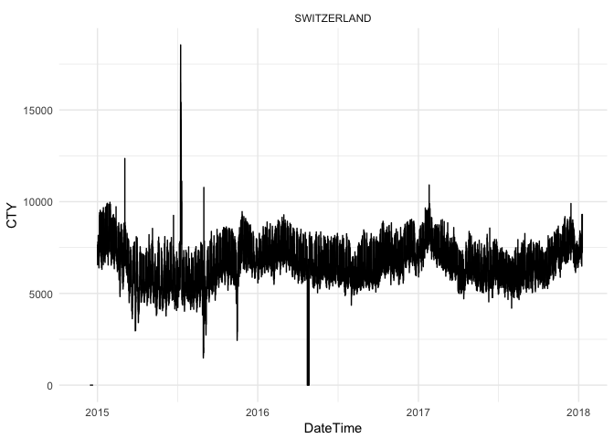
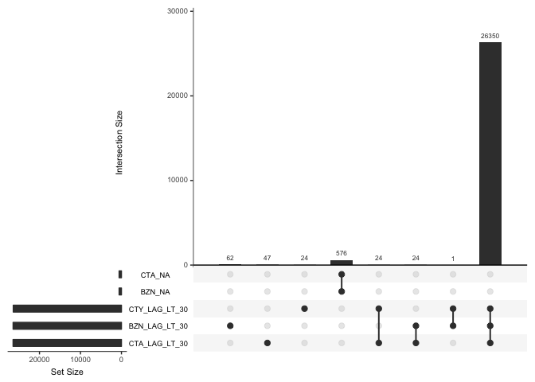

<!-- README.md is generated from README.Rmd. Please edit that file -->
[](https://travis-ci.org/rte-antares-rpackage/antaDraft) [](https://ci.appveyor.com/project/rte-antares-rpackage/antaDraft) [](https://CRAN.R-project.org/package=antaDraft) [](http://www.repostatus.org/#wip) [](https://codecov.io/gh/rte-antares-rpackage/antaDraft)

antaDraft
=========

Le package contient un ensemble de fonctions pour vérifier et corriger des données entsoe.

L'objectif du package est de permettre la création d'un jeu de données complet pour deux années de données et pour plusieurs pays.

Les données peuvent être manquantes ou imparfaites. Il s'agit de permettre :

-   l'identification des problèmes,
-   leur reporting afin de permettre leur correction par l'entsoe,
-   leur correction si la donnée n'a pu être corrigée par l'entsoe.

La procédure est pour l'instant implémentée pour les données de consommation.

Utilisation
-----------

On va charger l'ensemble des données archivées sur archive.org à l'URL suivante : <https://archive.org/details/RTE_load>

Le zip à charger est le suivant: <https://archive.org/download/RTE_load/load.zip>.

``` r
load_dir <- file.path(tempdir(), "load_files" )
load_zip <- file.path(tempdir(), "load.zip" )

local_zip <- "/Users/davidgohel/Documents/consulting/RTE/load.zip"
if( file.exists(local_zip))
  file.copy(local_zip, load_zip, overwrite = TRUE )
#> [1] TRUE

if( !file.exists(load_zip) )
  download.file(url = "https://archive.org/download/RTE_load/load.zip", 
                destfile = load_zip )

if( dir.exists(load_dir) )
  unlink(load_dir, recursive = TRUE, force = TRUE)

utils::unzip(load_zip, exdir = load_dir )
```

Les données sont disponibles dans le répertoire /var/folders/51/6jygptvs3bb4njv0t6x7br900000gn/T//Rtmplu1jVV/load\_files. Celui ci contient les fichiers suivants :

``` r
csv_files <- list.files(load_dir, full.names = TRUE, pattern = "\\.csv$")
csv_infos <- file.info(csv_files)[, c(1, 3) ]
row.names(csv_infos) <- NULL
csv_infos$file <- basename(csv_files)

kable(csv_infos)
```

|      size|  mode| file                          |
|---------:|-----:|:------------------------------|
|   4818386|   644| 2014\_12\_ActualTotalLoad.csv |
|  11754185|   644| 2015\_1\_ActualTotalLoad.csv  |
|  11875151|   644| 2015\_10\_ActualTotalLoad.csv |
|  11310245|   644| 2015\_11\_ActualTotalLoad.csv |
|  11781045|   644| 2015\_12\_ActualTotalLoad.csv |
|  10726041|   644| 2015\_2\_ActualTotalLoad.csv  |
|  11786273|   644| 2015\_3\_ActualTotalLoad.csv  |
|  11696767|   644| 2015\_4\_ActualTotalLoad.csv  |
|  12125893|   644| 2015\_5\_ActualTotalLoad.csv  |
|  11541557|   644| 2015\_6\_ActualTotalLoad.csv  |
|  11875512|   644| 2015\_7\_ActualTotalLoad.csv  |
|  11475232|   644| 2015\_8\_ActualTotalLoad.csv  |
|  11390834|   644| 2015\_9\_ActualTotalLoad.csv  |
|  11418000|   644| 2016\_1\_ActualTotalLoad.csv  |
|  11872808|   644| 2016\_10\_ActualTotalLoad.csv |
|  11450892|   644| 2016\_11\_ActualTotalLoad.csv |
|  11911508|   644| 2016\_12\_ActualTotalLoad.csv |
|  10714419|   644| 2016\_2\_ActualTotalLoad.csv  |
|  11895715|   644| 2016\_3\_ActualTotalLoad.csv  |
|  11049161|   644| 2016\_4\_ActualTotalLoad.csv  |
|  11393888|   644| 2016\_5\_ActualTotalLoad.csv  |
|  11050699|   644| 2016\_6\_ActualTotalLoad.csv  |
|  11617278|   644| 2016\_7\_ActualTotalLoad.csv  |
|  11567217|   644| 2016\_8\_ActualTotalLoad.csv  |
|  11134715|   644| 2016\_9\_ActualTotalLoad.csv  |
|  11780627|   644| 2017\_1\_ActualTotalLoad.csv  |
|  12195737|   644| 2017\_10\_ActualTotalLoad.csv |
|   6721301|   644| 2017\_11\_ActualTotalLoad.csv |
|  10569835|   644| 2017\_2\_ActualTotalLoad.csv  |
|  11947416|   644| 2017\_3\_ActualTotalLoad.csv  |
|  11574205|   644| 2017\_4\_ActualTotalLoad.csv  |
|  11942550|   644| 2017\_5\_ActualTotalLoad.csv  |
|  11595339|   644| 2017\_6\_ActualTotalLoad.csv  |
|  11714825|   644| 2017\_7\_ActualTotalLoad.csv  |
|  11457734|   644| 2017\_8\_ActualTotalLoad.csv  |
|  11212010|   644| 2017\_9\_ActualTotalLoad.csv  |

### Les données brutes

Avant de dégager une série de consommation par pays

``` r
library(antaDraft)
load_data <- anta_load_read(data_dir = load_dir )
```

### Validation des données brutes

L'opération va ajouter autant de colonnes qu'il y a de tests exprimés dans le fichier `config/load/raw_validate.yml`.

Ce fichier décrit les règles de validation de chaque ligne de donnée.

<!--html_preserve-->
<pre>rules:

- expr: observed==TRUE
  name: IS_OBS
- expr: is.finite(TotalLoadValue)
  name: IS_FINITE
- expr: sign(TotalLoadValue)&gt;0
  name: IS_POS
</pre>
<!--/html_preserve-->
``` r
load_data <- augment_validation(load_data)
head(load_data)
#>     DateTime  MapCode AreaTypeCode country TotalLoadValue observed IS_OBS
#> 1 2014-12-01       AT          CTA AUSTRIA             NA     TRUE   TRUE
#> 2 2014-12-01       AT          CTY AUSTRIA             NA     TRUE   TRUE
#> 3 2014-12-01 DE_AT_LU          BZN AUSTRIA       11239.13     TRUE   TRUE
#> 4 2014-12-01       BE          BZN BELGIUM        9100.34     TRUE   TRUE
#> 5 2014-12-01       BE          CTA BELGIUM        9100.34     TRUE   TRUE
#> 6 2014-12-01       BE          CTY BELGIUM        9100.34     TRUE   TRUE
#>   IS_FINITE IS_POS
#> 1     FALSE   TRUE
#> 2     FALSE   TRUE
#> 3      TRUE   TRUE
#> 4      TRUE   TRUE
#> 5      TRUE   TRUE
#> 6      TRUE   TRUE
```

### Les données agrégées

On va produire les données agrégées avec la fonction `aggregate_with_rules`. Les règles sont exprimées dans le fichier `config/load/cty_rules.yml`.

<!--html_preserve-->
<pre>FRANCE:
  CTY:
    - FR
  CTA:
    - FR
  BZN:
    - FR

BELGIUM:
  CTY:
    - BE
  CTA:
    - BE
  BZN:
    - BE

SWITZERLAND:
  CTY:
    - CH
  CTA:
    - CH
  BZN:
    - CH

SPAIN:
  CTY:
    - ES
  CTA:
    - ES
  BZN:
    - ES

NETHERLANDS:
  CTY:
    - NL
  CTA:
    - NL
  BZN:
    - NL

PORTUGAL:
  CTY:
    - PT
  CTA:
    - PT
  BZN:
    - PT

ITALY:
  CTY:
    - IT
  CTA:
    - IT
  BZN:
    - IT_CNOR
    - IT_CSUD
    - IT_NORD
    - IT_SARD
    - IT_SICI
    - IT_SUD

GERMANY:
  CTY:
    - DE
  CTA:
    - DE_TenneT_GER
    - DE_TransnetBW
    - DE_Amprion
    - DE_50HzT
  BZN:
    - DE_AT_LU
    - "!CTY|AUSTRIA"
    - "!CTY|LUXEMBOURG"

AUSTRIA:
  CTY:
    - AT
  CTA:
    - AT
  BZN:
    - DE_AT_LU
    - "!CTY|GERMANY"
    - "!CTY|LUXEMBOURG"

UK:
  CTY:
    - GB
    - "!CTA|NORTH_IRELAND"
  CTA:
    - GB
  BZN:
    - GB

IRELAND:
  CTY:
    - IE
  CTA:
    - IE
  BZN:
    - IE_SEM
    - "!CTA|NORTH_IRELAND"

NORTH_IRELAND:
  CTY:
    - NIE
  CTA:
    - NIE
  BZN:
    - IE_SEM
    - "!CTY|IRELAND"

LUXEMBOURG:
  CTY:
    - LU
  CTA:
    - LU
  BZN:
    - DE_AT_LU
    - "!CTY|GERMANY"
    - "!CTY|AUSTRIA"
</pre>
<!--/html_preserve-->
La fonction prend des données de *load* comme argument, c'est à dire obtenue avec la fonction `anta_load_read()`.

``` r
aggregated_db <- aggregate_with_rules(load_data)
```

Ces données peuvent être représentées graphiquement avec la fonction `plot` (voire `?plot.aggregated`).

``` r
plot(aggregated_db, subset = aggregated_db$country %in% "SWITZERLAND")
```



### Validation des données agrégées

Comme pour les données brutes, l'opération va ajouter autant de colonnes qu'il y a de tests exprimés dans le fichier `agg_validate.yml`.

<!--html_preserve-->
<pre>rules:

- expr: is.finite(CTY)
  name: CTY_NA
- expr: is.finite(CTA)
  name: CTA_NA
- expr: is.finite(BZN)
  name: BZN_NA

- expr: CTY &gt; 0
  name: CTY_IS_POS
- expr: CTA &gt; 0
  name: CTA_IS_POS
- expr: BZN &gt; 0
  name: BZN_IS_POS

- expr: abs(CTY-CTA) &lt; 1
  name: CTY_CTA_EQUAL
- expr: abs(CTY-BZN) &lt; 1
  name: CTY_BZN_EQUAL
- expr: abs(CTA-BZN) &lt; 1
  name: CTA_BZN_EQUAL


- expr: abs(1 - (CTY / CTA) ) &lt; .05
  name: CTY_CTA_DIFF_LT_05
- expr: abs(1 - (CTY / BZN) ) &lt; .05
  name: CTY_BZN_DIFF_LT_05
- expr: abs(1 - (CTA / BZN) ) &lt; .05
  name: CTA_BZN_DIFF_LT_05

- expr: abs(1 - (CTY / CTA) ) &lt; .1
  name: CTY_CTA_DIFF_LT_10
- expr: abs(1 - (CTY / BZN) ) &lt; .1
  name: CTY_BZN_DIFF_LT_10
- expr: abs(1 - (CTA / BZN) ) &lt; .1
  name: CTA_BZN_DIFF_LT_10


- expr: (is.na(data.table::shift(CTY)) | sign(CTY) &lt; 1 | (abs(CTY - data.table::shift(CTY)) / CTY) &lt; .3 ) &amp; ( is.na(data.table::shift(CTY)) | sign(CTY) &lt; 1 | (abs(data.table::shift(CTY) - CTY) / data.table::shift(CTY)) &lt; .3 )
  name: CTY_LAG_LT_30
- expr: ( is.na(data.table::shift(CTA)) | sign(CTA) &lt; 1 | (abs(CTA - data.table::shift(CTA)) / CTA) &lt; .3 ) &amp; ( is.na(data.table::shift(CTA)) | sign(CTA) &lt; 1 | (abs(data.table::shift(CTA) - CTA) / data.table::shift(CTA)) &lt; .3 )
  name: CTA_LAG_LT_30
- expr: ( is.na(data.table::shift(BZN)) | sign(BZN) &lt; 1 | (abs(BZN - data.table::shift(BZN)) / BZN)  &lt; .3 ) &amp; (is.na(data.table::shift(BZN)) | sign(BZN) &lt; 1 | (abs(data.table::shift(BZN) - BZN) / data.table::shift(BZN)) &lt; .3 )
  name: BZN_LAG_LT_30

</pre>
<!--/html_preserve-->
``` r
aggregated_db <- augment_validation(aggregated_db)
```

Ces données peuvent être représentées graphiquement avec la fonction `plot` (voire `?plot.controled`).

``` r
plot(aggregated_db, subset = aggregated_db$country %in% "SWITZERLAND")
#> Called from: plot.controled(aggregated_db, subset = aggregated_db$country %in% 
#>     "SWITZERLAND")
#> debug à /Users/davidgohel/Github/antaDraft/R/plot_functions.R#114 :upset(as.data.frame(data), ...)
```



    #> debug à /Users/davidgohel/Github/antaDraft/R/plot_functions.R#115 :invisible()

### Correction mécanique des données agrégées

``` r
aggregated_db <- data_correct_with_rules(aggregated_db)
```

### Qualification résumée des lignes agrégées

``` r
aggregated_db <- augment_process_summary(aggregated_db)

library(dplyr)
library(tidyr)
aggregated_db %>% 
  group_by_at(c( "country", "summary") ) %>% 
  tally() %>% 
  spread(summary, n) %>% 
  kable()
```

| country        |  corrected|  invalid|  original|
|:---------------|----------:|--------:|---------:|
| AUSTRIA        |      13983|       35|     11982|
| BELGIUM        |          9|      285|     25706|
| FRANCE         |          1|      396|     25603|
| GERMANY        |      14006|       11|     11983|
| IRELAND        |          9|     2729|     23262|
| ITALY          |         NA|      790|     25210|
| LUXEMBOURG     |      13848|      390|     11762|
| NETHERLANDS    |         28|       29|     25943|
| NORTH\_IRELAND |      21307|     4693|        NA|
| PORTUGAL       |       1047|      176|     24777|
| SPAIN          |        767|      502|     24731|
| SWITZERLAND    |         25|      877|     25098|
| UK             |          1|      767|     25232|

Correction des données par modèles de prévisions
------------------------------------------------

Il faut dans un premier temps enrichir la base de données avec des variables potentiellement explicatives. On utilise la fonction `as_learning_db`.

``` r
dat <- as_learning_db(aggregated_db )
head(dat)
#>   country            DateTime BZN CTA CTY CTY_NA CTA_NA BZN_NA CTY_IS_POS
#> 1 AUSTRIA 2014-12-01 00:00:00   0   0   0   TRUE   TRUE   TRUE      FALSE
#> 2 AUSTRIA 2014-12-01 01:00:00   0   0   0   TRUE   TRUE   TRUE      FALSE
#> 3 AUSTRIA 2014-12-01 02:00:00   0   0   0   TRUE   TRUE   TRUE      FALSE
#> 4 AUSTRIA 2014-12-01 03:00:00   0   0   0   TRUE   TRUE   TRUE      FALSE
#> 5 AUSTRIA 2014-12-01 04:00:00   0   0   0   TRUE   TRUE   TRUE      FALSE
#> 6 AUSTRIA 2014-12-01 05:00:00   0   0   0   TRUE   TRUE   TRUE      FALSE
#>   CTA_IS_POS BZN_IS_POS CTY_CTA_EQUAL CTY_BZN_EQUAL CTA_BZN_EQUAL
#> 1      FALSE      FALSE          TRUE          TRUE          TRUE
#> 2      FALSE      FALSE          TRUE          TRUE          TRUE
#> 3      FALSE      FALSE          TRUE          TRUE          TRUE
#> 4      FALSE      FALSE          TRUE          TRUE          TRUE
#> 5      FALSE      FALSE          TRUE          TRUE          TRUE
#> 6      FALSE      FALSE          TRUE          TRUE          TRUE
#>   CTY_CTA_DIFF_LT_05 CTY_BZN_DIFF_LT_05 CTA_BZN_DIFF_LT_05
#> 1               TRUE               TRUE               TRUE
#> 2               TRUE               TRUE               TRUE
#> 3               TRUE               TRUE               TRUE
#> 4               TRUE               TRUE               TRUE
#> 5               TRUE               TRUE               TRUE
#> 6               TRUE               TRUE               TRUE
#>   CTY_CTA_DIFF_LT_10 CTY_BZN_DIFF_LT_10 CTA_BZN_DIFF_LT_10 CTY_LAG_LT_30
#> 1              FALSE              FALSE              FALSE          TRUE
#> 2              FALSE              FALSE              FALSE          TRUE
#> 3              FALSE              FALSE              FALSE          TRUE
#> 4              FALSE              FALSE              FALSE          TRUE
#> 5              FALSE              FALSE              FALSE          TRUE
#> 6              FALSE              FALSE              FALSE          TRUE
#>   CTA_LAG_LT_30 BZN_LAG_LT_30 rule_0002_CTY rule_0001_CTA summary is_off
#> 1          TRUE          TRUE         FALSE         FALSE invalid  FALSE
#> 2          TRUE          TRUE         FALSE         FALSE invalid  FALSE
#> 3          TRUE          TRUE         FALSE         FALSE invalid  FALSE
#> 4          TRUE          TRUE         FALSE         FALSE invalid  FALSE
#> 5          TRUE          TRUE         FALSE         FALSE invalid  FALSE
#> 6          TRUE          TRUE         FALSE         FALSE invalid  FALSE
#>   likely_off year.iso week.iso hour.iso day.iso light_time
#> 1      FALSE     2014       49        0       2        524
#> 2      FALSE     2014       49        1       2        524
#> 3      FALSE     2014       49        2       2        524
#> 4      FALSE     2014       49        3       2        524
#> 5      FALSE     2014       49        4       2        524
#> 6      FALSE     2014       49        5       2        524
#>   HOUR_SHIFT_CTY_PLUS_1 HOUR_SHIFT_CTY_MINUS_1 DAILY_MIN_CTY_PLUS_1
#> 1                    NA                     NA                   NA
#> 2                    NA                     NA                   NA
#> 3                    NA                     NA                   NA
#> 4                    NA                     NA                   NA
#> 5                    NA                     NA                   NA
#> 6                    NA                     NA                   NA
#>   DAILY_AVG_CTY_PLUS_1 DAILY_MAX_CTY_PLUS_1 DAILY_MIN_CTY_MINUS_1
#> 1                   NA                   NA                  6306
#> 2                   NA                   NA                  6306
#> 3                   NA                   NA                  6306
#> 4                   NA                   NA                  6306
#> 5                   NA                   NA                  6306
#> 6                   NA                   NA                  6306
#>   DAILY_AVG_CTY_MINUS_1 DAILY_MAX_CTY_MINUS_1
#> 1              7581.317                8661.2
#> 2              7581.317                8661.2
#> 3              7581.317                8661.2
#> 4              7581.317                8661.2
#> 5              7581.317                8661.2
#> 6              7581.317                8661.2
```

On peut alors créer deux modèles, un dépandant des mesures suivantes et un dépendant des mesures précédentes.

On utilisera pour cela la fonction `define_model_rf`. Celle-ci sauvegarde les modèles dans un répertoire local à la machine.

``` r
repertoire_model <- tempfile()
dir.create(repertoire_model, showWarnings = FALSE, recursive = TRUE)
```

Création du modèle *backward*:

``` r
x_vars <- c(
  "year.iso", "week.iso", "hour.iso", "day.iso", "light_time",
  "is_off", "likely_off",
  "DAILY_MIN_CTY_MINUS_1", "DAILY_AVG_CTY_MINUS_1", "DAILY_MAX_CTY_MINUS_1",
  "HOUR_SHIFT_CTY_MINUS_1")

dat <- define_model_rf( 
  data = dat, x_vars = x_vars, y_var = "CTY",
  save_model_dir = repertoire_model, id = "BACKWARD" )
```

Création du modèle *forward*:

``` r
x_vars <- c(
  "year.iso", "week.iso", "hour.iso", "day.iso", "light_time",
  "is_off", "likely_off",
  "DAILY_MIN_CTY_PLUS_1", "DAILY_AVG_CTY_PLUS_1", "DAILY_MAX_CTY_PLUS_1",
  "HOUR_SHIFT_CTY_PLUS_1")

dat <- define_model_rf( 
  data = dat, x_vars = x_vars, y_var = "CTY",
  save_model_dir = repertoire_model, id = "FORWARD" )
```

Maintenant qu'on a deux modèles, on peut les utiliser en boucle pour remplacer les valeurs invalides par des valeurs prévues par les modèles.

``` r
for(i in 1:12 ){
  dat <- impute_with_model(dat, id = "FORWARD")
  dat <- impute_with_model(dat, id = "BACKWARD")
  dat <- update_learning_db(dat)
}
```

``` r
library(dplyr)
library(tidyr)
dat %>% 
  group_by_at(c( "country", "summary") ) %>% 
  tally() %>% 
  spread(summary, n) %>% 
  kable()
```
